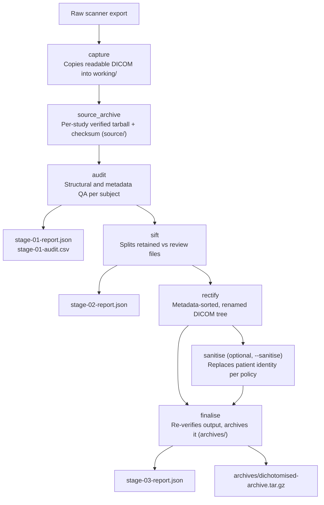

# dichotomise [](https://github.com/srikash/dichotomise/releases/tag/v2.0.0) [](LICENSE) [](https://github.com/srikash/dichotomise/actions/workflows/ci.yml)
<b><ins>DIC</ins></b>h<b><ins>O</ins></b>to<b><ins>M</ins></b>ise is a command-line tool for checking, sorting, renaming,
de-identifying, and archiving DICOM exports from Siemens XA60+ systems.

### The default export

For a given study, the XA60+ export places DICOMs from each series into sub-folders named:
```text
<ProtocolName>_<SeriesNumber>_MR/
```

The DICOMs inside are named `1.dcm`, `2.dcm`, and so on. The numbering starts again in 
every series folder and recurs across subject exports. 

```text
subject-export/
  DWI_21_MR/
    1.dcm
    2.dcm
  fMRI_22_MR/
    1.dcm
    2.dcm
```
`1.dcm` in one series may be entirely unrelated to `1.dcm` in another. The
files can contain different acquisitions and have different file sizes.

## Why repeated filenames are positively dreadful

#### TL;DR

Naming files `1.dcm`, `2.dcm`, `3.dcm` is the worst possible choice. It is a
regression from something that previously worked well.

| Export | File naming |
|---|---|
| Older exports | Distinct `.IMA` filenames |
| XA30 exports | Distinct `.dcm` filenames |
| XA60+ exports | `1.dcm`, `2.dcm`, … repeated in every series folder |

Every DICOM carries a globally unique SOP Instance UID. The XA60 export retains 
that identifier in the header but does not use it to distinguish the exported
filename. The file's name identifies it only while its surrounding folder
structure remains intact. That is a data-integrity problem at the point of
export, before a researcher runs a pipeline or moves a file.

FAIR principle **F1** calls for globally unique, persistent identifiers for
data. The DICOM header supplies one; the exported filename hides it from
ordinary file operations. BIDS takes the opposite approach to filenames: its
applicable entities identify the data within the filename itself.

### The new export format is the antithesis of good data-handling practice

1. **Give each file a usable identity.** XA60+ assigns the same name to
   unrelated DICOMs. A file separated from its folder cannot be identified by
   name, although its SOP Instance UID remains in its header. This undermines
   findability at the file-system level and makes safe handling depend on
   reading DICOM metadata every time.

2. **Keep the file and its context in agreement.** The export uses a series
   folder to provide context that the filename lacks. If that folder
   contradicts the DICOM header, the name offers no independent clue.
   
   [Example Incident 1](#incident-1-dicom-placed-in-the-wrong-series) shows that this
   disagreement occurred in a single export with no user intervention.

3. **Make collisions visible before they cost data.** When exports are
   combined, flattened or restored into one directory, repeated names
   collide. Depending on the operation and its settings, a collision can
   overwrite a file or stop the transfer. Either way, the filename cannot
   distinguish the DICOMs involved. Safe reuse demands an explicit identity
   check, not trust in the exported names.

4. **Preserve the evidence needed to audit and reuse data.** Matching
   filenames do not establish that two DICOMs contain the same instance or
   the same scan content. Counters alone cannot verify completeness, detect a
   misplaced instance or establish where a file came from. FAIR **R1.2**
   calls for detailed provenance; losing a file's folder context makes that
   provenance harder to recover from the export, even though metadata remains
   in the DICOM.

   [Example Incident 2](#incident-2-interleaved-dwi-duplication) shows
   why a plausible filename sequence cannot serve as an audit.

### Two example incidents (from amongst several)

We noticed inconsistencies in scanner exports and inspected the DICOM metadata
manually. Both incidents below were present before anyone copied, moved or
processed the files. They are examples of the intermittent, inconsistent
errors we have encountered, not an exhaustive list. These occur in product sequences
and C2Ps alike.

#### Incident 1: DICOM placed in the wrong series

`300.dcm` appeared in the folder for Series 21. We checked its DICOM Series
Number and Instance UID and found that the file belonged to Series 22. The
export's folder contradicted the file's metadata.

#### Incident 2: Interleaved DWI duplication

We expected 81 DICOMs in a DWI series, but the export contained 162. Manual
inspection found that duplicates were randomly interleaved with the original
files, rather than appended as a second sequence. The filename range and file
count alone could not show which files were duplicated.

# dichotomise to the rescue

`dichotomise` addresses this failure at ingestion. It reads identity from
DICOM metadata rather than trusting exported filenames or series folders. It
preserves the original files, audits for duplicate content and inconsistent
placement or metadata, separates files needing review, and writes clearly
named, verified output.

The tool is intended for any DICOM export that needs structured auditing,
sorting and validation. Its immediate motivation is the XA60+ export: a
globally unique identifier is already inside each DICOM, yet the scanner
hands researchers filenames that cannot distinguish one file from another
outside a fragile folder hierarchy.

## What it does

One command runs the full pipeline, in order:

1. **capture** — copies readable DICOM files into a working folder, grouping files
   by `(PatientID, StudyInstanceUID)` from their own headers, never from
   folder names.
2. **source_archive** — archives each captured study's untouched DICOM files
   with a checksum before further processing.
3. **audit** — flags duplicate scan content (by comparing everything except
   each file's own unique ID), files sitting in the wrong series folder, and
   inconsistent patient, study, or series metadata within a physical DICOM
   folder. The CLI prints a Rich inventory table, and the reports include a
   spreadsheet-friendly CSV.
4. **sift** — splits files into `retained` and `review`, physically, so a
   flagged file is never silently included.
5. **rectify** — copies retained files into a sorted, clearly named tree:
   `<series number>-<series description>/<series>_<series ID>_<instance>_e<echo>.dcm`.
6. **sanitise** *(optional, `--sanitise`)* — replaces patient identity
   according to a chosen policy; see [Sanitisation](#sanitisation) below.
7. **finalise** — independently re-reads the finished output tree (not a
   cached record from earlier stages) to catch any corruption introduced by
   copying or renaming, then archives it with a checksum.

This is a from-scratch, simplified rewrite of the original `dichotomise`,
aimed at being easy to read, debug, and extend, including for someone new to
Python. It implements a single end-to-end pipeline; there is no separate
expert/stage-by-stage command.

## Installation

`dichotomise` requires Python 3.11+ and [uv](https://docs.astral.sh/uv/).

If you already have Python and `pip`:

```bash
python -m pip install --user uv
```

Otherwise, install uv directly:

```bash
curl -LsSf https://astral.sh/uv/install.sh | sh
```

### Install from PyPI (after release)

```bash
uv tool install --python 3.11 dichotomise
dichotomise --help
```

This creates an isolated environment for `dichotomise`. If Python 3.11 is not
available, uv downloads it automatically.

### Install from a source checkout

```bash
git clone https://github.com/srikash/dichotomise.git
cd dichotomise
uv venv --python 3.11
uv sync --locked
uv run dichotomise --help
```

## Usage

```bash
dichotomise --source-dir ./study/sub-001 --out-dir ./dichotomise-runs
```

To inspect an export without creating an output directory or saving a report:

```bash
dichotomise --qc --source-dir ./study/sub-001
```

`--qc` reads the DICOMs in place and prints the Rich audit table in the
terminal. It never copies, changes, archives, or writes files.

`--source-dir` accepts either one subject/session export or a scanner export
containing multiple subjects — they are discovered from DICOM metadata, so
folder names do not need to be sensible.

| Flag | Purpose |
|---|---|
| `--source-dir` (required) | Raw DICOM directory to process. |
| `--out-dir` | Parent directory for the timestamped output folder. Required unless `--qc` is used. |
| `--qc` | Audit the source DICOMs in place and print tables only. Cannot be combined with processing flags. |
| `--sanitise` | Replace patient identity before final archiving. This uses `minimal` unless a policy is chosen. |
| `--sanitise-policy` | JSON policy name: `minimal` (the default), `standard`, `full`, `retain`, `custom`, or a policy you add yourself. Both `custom` and `custom.json` are accepted. Implies `--sanitise`. |
| `--subj-id` | First numerical replacement ID. For one study, `6` produces `sub-0006`. With several studies, IDs are enumerated automatically as `sub-0006`, `sub-0007`, `sub-0008`, and so on; the CLI logs a warning. |
| `--new-id` | Replacement ID for one study. `ADNC0751` becomes `sub-ADNC0751`; an existing `sub-` prefix is retained. |
| `--random-name` | Generate a random replacement name using the `minimal` sanitisation policy. |
| `--mapping` | One or more `PatientID:replacement_id` pairs. Repeat the flag or separate pairs with commas. The PatientID must exactly match the DICOM `PatientID`. |
| `--mapping-file` | JSON object mapping DICOM PatientID to replacement ID, for example `{"source-01": "sub-0001"}`. A full path may be given with or without the `.json` suffix. |
| `--keep-working-files` | Keep the copied and processed DICOM files (`working/`) instead of deleting them once the archives are verified. |

For one study, use `--subj-id`, `--random-name`, or `--new-id`. For several
studies, use `--subj-id` (automatic enumeration), `--random-name`, `--mapping`,
or `--mapping-file`; `--new-id` remains intentionally limited to one study.

[`docs/example-mapping.json`](docs/example-mapping.json) is a ready-to-copy
mapping-file example. Its keys must match the source DICOM `PatientID` values;
its values are the exact replacement labels to write. Its `instructions` field
is ignored by the CLI.

## Output structure

Every run creates one timestamped, UTC output folder beneath `--out-dir`:

```text
<run-timestamp>_dichotomise_outputs/
  source/
    <patient-id>_<6char-hex>_source-archive_<run-timestamp>.tar.gz
    <patient-id>_<6char-hex>_source-archive_<run-timestamp>.sha256
  archives/
    <subject-label>_<6char-hex>_dichotomised-archive_<run-timestamp>.tar.gz
    <subject-label>_<6char-hex>_dichotomised-archive_<run-timestamp>.sha256
  working/                   # temporary, removed unless --keep-working-files
  reports/
    <subject-label>_<6char-hex>/
      stage-01-report.json
      stage-01-audit.csv
      stage-02-report.json
      stage-03-report.json
  run-status.json             # in_progress, complete, or failed
```

`run-status.json` lets you distinguish a complete result from one left by a
failed or interrupted run. It contains no patient details.

A multi-subject run produces one `source/` archive and one `archives/` archive
per study. Each source archive name uses the original patient ID plus a random
six-character hexadecimal suffix. The source archive contains untouched DICOM
files and their original headers, including patient identity; use the
sanitised `archives/` output for sharing.

Processed archive and report names use the study's `<subject-label>` plus a
random six-character hexadecimal suffix. `<subject-label>` is the real
`PatientID`, unless `--sanitise` was used, in which case it is the replacement
label. A sanitised archive's filename and DICOM headers therefore do not
expose the original identifier.

### Reports

Each study has a directory under `reports/` containing:

- `stage-01-report.json` — audit totals, duplicate and misfiled folders, and
  one summary per physical DICOM folder.
- `stage-01-audit.csv` — the same per-folder audit summary for spreadsheets,
  including duplicate/misfiled counts and differing metadata fields.
- `stage-02-report.json` — files retained versus copied to `review/`.
- `stage-03-report.json` — archive checksum and a `series_inventory` with the
  first original and final DICOM filename for every series.

The audit table and CSV flag differences in Patient ID/name, study UID/date/
time, and series UID/number/description/protocol within a DICOM folder.

Compression is always `.tar.gz`.

## Sanitisation

`--sanitise` applies a named policy — a small JSON file describing what
happens to each DICOM field: kept, removed, replaced with a fixed or
run-specific value, given a newly generated identifier (consistent across
every file for that subject), a birth date scrambled to an approximate but
different year, or a randomly generated placeholder name.

Five policies ship in `src/dichotomise/pydcm/policies/`:

| Policy | What happens |
|---|---|
| `retain` | Nothing changed. |
| `standard` | Identity, patient address, accession number, institution, and device-operator fields removed; every UID reissued; birth date scrambled by ±1 year (day/month randomised too); demographic fields (e.g. sex) and all scan-descriptive text (protocol name, series/study description, etc.) kept. |
| `full` | Everything `standard` does, plus scan-descriptive text and the device serial number also removed. |
| `minimal` *(the default level)* | Everything `standard` does, but a generated pseudonym is used for both patient name (`Abrahall^Gracious`) and patient ID/output name (`abrahall_gracious`); the birth date is the scan date rather than scrambled. |
| `custom` | A worked, commented example for building your own — not used automatically. |

Full detail — including the real scanner-export comparison these were
built from, the policy file schema, and how to write your own — is in
[`docs/sanitise-policies.md`](docs/sanitise-policies.md). In short: copy
`custom.json` to `<your-policy-name>.json` in the same folder, edit it, and
run with `--sanitise-policy <your-policy-name>`.

## Layout

```text
src/dichotomise/
  cli.py               # the `dichotomise` command (Click + Rich)
  pipeline.py           # runs every stage in order
  run.py                 # output paths for one run
  errors.py              # error types
  stages/                 # one file per pipeline stage
  pydcm/                   # DICOM-specific metadata and sanitisation logic
    policies/                # the sanitisation policy JSON files
    names.py                 # a self-contained adjective+surname placeholder-name generator
  utils/                    # generic filesystem/archive/console helpers
```

## Development

```bash
uv run pytest
uv run ruff format .
uv run ruff check .
uv run mypy src
```

`tests/data/` (real, non-synthetic scan exports used for some tests) is
gitignored and never committed — it may contain identifying information.

## The dichotomise workflow



The project is licensed under the MIT License.
