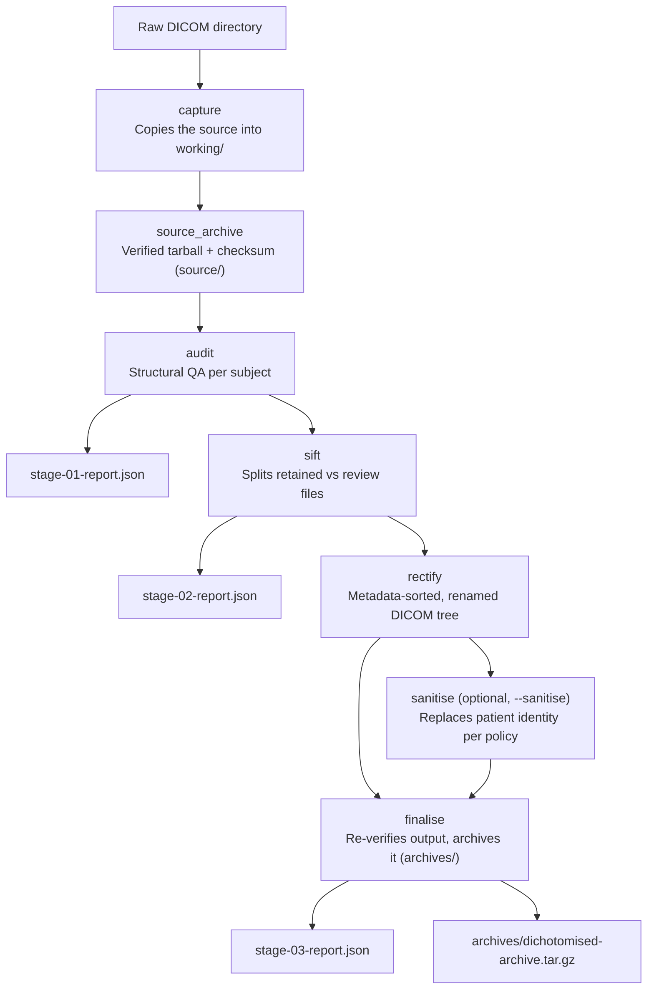

# dichotomise

A command-line tool for auditing, sorting, rectifying, and archiving DICOM
exports from Siemens XA60+ systems.

## The default export

XA60+ exports commonly place each series in a directory named:

```text
<ProtocolName>_<SeriesNumber>_MR/
```

The DICOMs inside are named `1.dcm`, `2.dcm`, and so on. The same generic
filenames recur in every series directory and across subject exports.

```text
subject-export/
  DWI_21_MR/
    1.dcm
    2.dcm
  fMRI_22_MR/
    1.dcm
    2.dcm
```

`1.dcm` in one series may be entirely unrelated to `1.dcm` in another. The
files can contain different acquisitions and have different file sizes.

## Why repeated filenames are positively dreadful

The filename alone contains no subject, study, series, or instance identity.
Any copy, merge, restore, or script that loses part of the original directory
path can overwrite data or silently mix series and subjects.

Repeated generic names also make it harder to inspect an export, compare two
copies, or identify missing instances. Ordinary lexical ordering is
misleading: `1.dcm`, `10.dcm`, `11.dcm`, `2.dcm`.

### Anecdotes

In multiple instances, we have observed scanner-export errors that occurred
without user intervention. This indicates that it is not only a
file-management problem.

#### Incident 1: DICOM placed in the wrong series

`300.dcm` appeared in the folder for Series 21, while its DICOM metadata
identified it as Series 22. The directory path did not match the series
recorded in the DICOM header.

#### Incident 2: Interleaved DWI duplication

A DWI series expected to contain 81 DICOMs contained 162. The duplicate files
were interleaved with the originals rather than appended as a second
sequence, so a simple filename range or file count did not explain the
problem.

## dichotomise to the rescue

While motivated by these incidents, `dichotomise` is intended for any DICOM
export that needs structured audit, sorting, and validation.

`dichotomise` preserves and verifies the original export before processing
it. It reads DICOM metadata rather than trusting folder names, flags
duplicates and cross-series leakage, and writes a verified, clearly named
working copy.

## What it does

One command runs the full pipeline, in order:

1. **capture** — copies the raw export into a working folder, grouping files
   by `(PatientID, StudyInstanceUID)` from their own headers, never from
   folder names.
2. **source_archive** — archives the untouched, captured original, with a
   checksum, before anything else happens.
3. **audit** — flags duplicate scan content (by comparing everything except
   each file's own unique ID) and files sitting in the wrong series folder
   (by majority vote of what each folder's own files agree it should
   contain).
4. **sift** — splits files into `retained` and `review`, physically, so a
   flagged file is never silently included.
5. **rectify** — copies retained files into a sorted, clearly named tree:
   `<series number>-<protocol name>/<series>_<series ID>_<instance>_e<echo>.dcm`.
6. **sanitise** *(optional, `--sanitise`)* — replaces patient identity
   according to a chosen policy; see [Sanitisation](#sanitisation) below.
7. **finalise** — independently re-reads the finished output tree (not a
   cached record from earlier stages) to catch any corruption introduced by
   copying or renaming, then archives it with a checksum.

This is a from-scratch, simplified rewrite of the original `dichotomise`,
aimed at being easy to read, debug, and extend, including for someone new to
Python. It implements a single end-to-end pipeline; there is no separate
expert/stage-by-stage command.

## Installation

```bash
pip install -e .
```

Requires Python 3.11+.

## Usage

```bash
dichotomise --source-dir ./study/sub-001 --out-dir ./dichotomise-runs
```

`--source-dir` accepts either one subject/session export or a scanner export
containing multiple subjects — they are discovered from DICOM metadata, so
folder names do not need to be sensible.

| Flag | Purpose |
|---|---|
| `--source-dir` (required) | Raw DICOM directory to process. |
| `--out-dir` (required) | Parent directory for the timestamped output folder. |
| `--sanitise` | Replace patient identity before final archiving. |
| `--random-name` | Shortcut for `--sanitise --sanitise-level minimal`: replace the patient name with a random, readable placeholder (e.g. `Abrahall^Gracious`) instead of the plain subject label. Implies `--sanitise`; do not combine with a different `--sanitise-level`. |
| `--sanitise-mode` | How the replacement label is generated: `default` (derived from a `LAST^FIRST^YYYYMMDD`-shaped patient name), `numerical` (needs `--subject-id`), or `custom` (needs `--new-id`). Inferred from `--subject-id`/`--new-id` if not given. |
| `--sanitise-level` | Which policy to apply: `default`, `standard` (preferred), `full`, `minimal`, `custom`, or any policy you add yourself — see [Sanitisation](#sanitisation). Defaults to `standard` (or `minimal` if `--random-name` is given). |
| `--subject-id` | Numerical subject ID, for `--sanitise-mode numerical`. |
| `--new-id` | Exact replacement ID, for `--sanitise-mode custom`. |
| `--keep-working-files` | Keep the copied and processed DICOM files (`working/`) instead of deleting them once the archives are verified. |

## Output structure

Every run creates one timestamped, UTC output folder beneath `--out-dir`:

```text
<run-timestamp>_dichotomise_outputs/
  source/
    <run-timestamp>_<PatientID>_<scan-datetime>_source-archive.tar.gz
    <run-timestamp>_<PatientID>_<scan-datetime>_source-archive.sha256
  archives/
    <run-timestamp>_<subject-label>_<scan-datetime>_dichotomised-archive.tar.gz
    <run-timestamp>_<subject-label>_<scan-datetime>_dichotomised-archive.sha256
  working/                   # temporary, removed unless --keep-working-files
```

Two pieces of the design are agreed but not yet built: a `study-run.json`
run-status record, and per-subject `reports/<subject-label>_<scan-datetime>/
stage-01-report.json` (audit) / `stage-02-report.json` (sift) /
`stage-03-report.json` (finalise) files. Nothing writes these yet — the
`AuditResult`/`SiftResult`/`FinaliseResult` values each stage already
returns carry everything a report would need, so adding this is additive,
not a redesign.

A multi-subject run produces one `source/` archive and one `archives/`
archive **per subject** — each subject's data can be handed off on its own
without extracting anything from a larger bundle.

Every archive/checksum filename embeds the run timestamp, subject
identifier, and scan date/time itself, not just its parent folder name, so
identity and provenance survive the file being copied out of its run
folder. `<scan-datetime>` comes from the DICOM `StudyDate`/`StudyTime`
fields, used as scanned (the scanner's own local time, not converted to
match the run timestamp's UTC).

`source/` is always named from the real, raw `PatientID` — it is the
untouched original, sanitised or not. `archives/` and `reports/` use
`<subject-label>`: the real `PatientID`, unless `--sanitise` was used, in
which case it is the replacement label instead — a sanitised archive's
*filename* never leaks the real identifier, matching what's inside the
DICOM headers.

Compression is always `.tar.gz`.

## Sanitisation

`--sanitise` applies a named policy — a small JSON file describing what
happens to each DICOM field: kept, removed, replaced with a fixed or
run-specific value, given a newly generated identifier (consistent across
every file for that subject), a birth date scrambled to an approximate but
different year, or a randomly generated placeholder name.

Five policies ship in `src/dichotomise/pydcm/policies/`:

| Policy | What happens |
|---|---|
| `default` | Nothing changed. |
| `standard` *(the default level)* | Identity, institution, and device-operator fields removed; every UID reissued; birth date scrambled by ±1 year (day/month randomised too); demographic fields (e.g. sex) and all scan-descriptive text (protocol name, series/study description, etc.) kept. |
| `full` | Everything `standard` does, plus scan-descriptive text and the device serial number also removed. |
| `minimal` | Everything `standard` does, but the replacement name is a random, readable placeholder in standard `Surname^Firstname` form (e.g. `Abrahall^Gracious`) instead of the plain subject label, and the birth date is simply the scan date rather than scrambled. |
| `custom` | A worked, commented example for building your own — not used automatically. |

Full detail — including the real scanner-export comparison these were
built from, the policy file schema, and how to write your own — is in
[`docs/sanitise-policies.md`](docs/sanitise-policies.md). In short: copy
`custom.json` to `<your-policy-name>.json` in the same folder, edit it, and
run with `--sanitise-level <your-policy-name>`.

## Layout

```text
src/dichotomise/
  cli.py               # the `dichotomise` command (Click + Rich)
  pipeline.py           # runs every stage in order
  run.py                 # output paths for one run
  errors.py              # error types
  stages/                 # one file per pipeline stage
  pydcm/                   # DICOM-specific logic (the only place pydicom is imported)
    policies/                # the sanitisation policy JSON files
    names.py                 # a self-contained adjective+surname placeholder-name generator
  utils/                    # generic filesystem/archive/console helpers
```

## Development

```bash
uv run pytest
uv run ruff format .
uv run ruff check .
uv run mypy src
```

`tests/data/` (real, non-synthetic scan exports used for some tests) is
gitignored and never committed — it may contain identifying information.

## The dichotomise workflow



The project is licensed under the MIT License.
