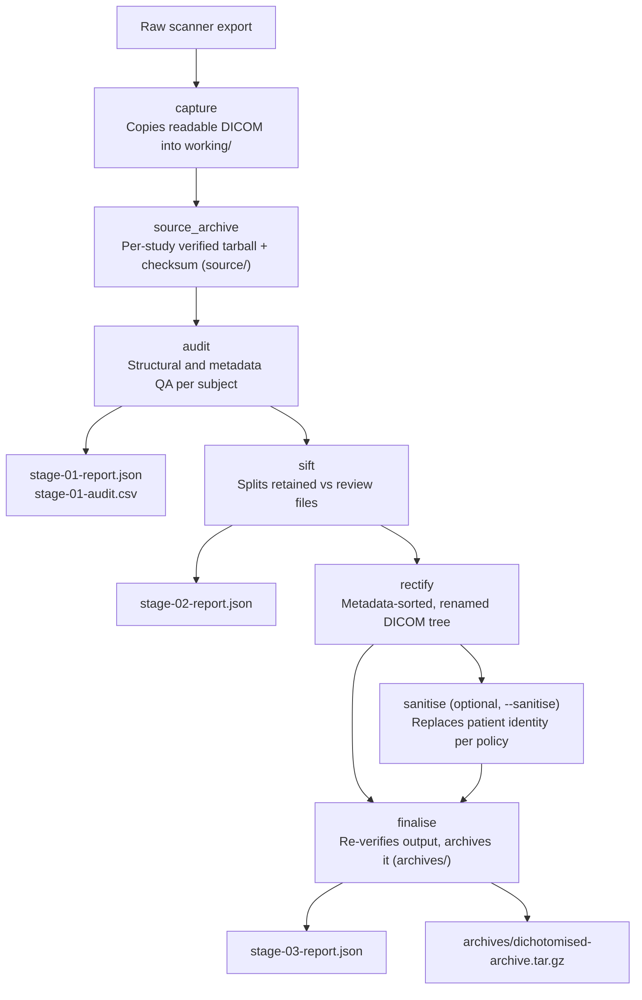

# dichotomise

A command-line tool for auditing, sorting, rectifying, and archiving DICOM
exports from Siemens XA60+ systems.

## The default export

XA60+ exports commonly place each series in a directory named:

```text
<ProtocolName>_<SeriesNumber>_MR/
```

The DICOMs inside are named `1.dcm`, `2.dcm`, and so on. The same generic
filenames recur in every series directory and across subject exports.

```text
subject-export/
  DWI_21_MR/
    1.dcm
    2.dcm
  fMRI_22_MR/
    1.dcm
    2.dcm
```

`1.dcm` in one series may be entirely unrelated to `1.dcm` in another. The
files can contain different acquisitions and have different file sizes.

## Why repeated filenames are positively dreadful

The filename alone contains no subject, study, series, or instance identity.
Any copy, merge, restore, or script that loses part of the original directory
path can overwrite data or silently mix series and subjects.

Repeated generic names also make it harder to inspect an export, compare two
copies, or identify missing instances. Ordinary lexical ordering is
misleading: `1.dcm`, `10.dcm`, `11.dcm`, `2.dcm`.

### Anecdotes

In multiple instances, we have observed scanner-export errors that occurred
without user intervention. This indicates that it is not only a
file-management problem.

#### Incident 1: DICOM placed in the wrong series

`300.dcm` appeared in the folder for Series 21, while its DICOM metadata
identified it as Series 22. The directory path did not match the series
recorded in the DICOM header.

#### Incident 2: Interleaved DWI duplication

A DWI series expected to contain 81 DICOMs contained 162. The duplicate files
were interleaved with the originals rather than appended as a second
sequence, so a simple filename range or file count did not explain the
problem.

## dichotomise to the rescue

While motivated by these incidents, `dichotomise` is intended for any DICOM
export that needs structured audit, sorting, and validation.

`dichotomise` preserves and verifies the original DICOM files before processing
them. It reads DICOM metadata rather than trusting folder names, flags
duplicate content, misplaced DICOMs, and inconsistent identity or series
metadata. It then writes verified, clearly named output.

## What it does

One command runs the full pipeline, in order:

1. **capture** — copies readable DICOM files into a working folder, grouping files
   by `(PatientID, StudyInstanceUID)` from their own headers, never from
   folder names.
2. **source_archive** — archives each captured study's untouched DICOM files
   with a checksum before further processing.
3. **audit** — flags duplicate scan content (by comparing everything except
   each file's own unique ID), files sitting in the wrong series folder, and
   inconsistent patient, study, or series metadata within a physical DICOM
   folder. The CLI prints a Rich inventory table, and the reports include a
   spreadsheet-friendly CSV.
4. **sift** — splits files into `retained` and `review`, physically, so a
   flagged file is never silently included.
5. **rectify** — copies retained files into a sorted, clearly named tree:
   `<series number>-<series description>/<series>_<series ID>_<instance>_e<echo>.dcm`.
6. **sanitise** *(optional, `--sanitise`)* — replaces patient identity
   according to a chosen policy; see [Sanitisation](#sanitisation) below.
7. **finalise** — independently re-reads the finished output tree (not a
   cached record from earlier stages) to catch any corruption introduced by
   copying or renaming, then archives it with a checksum.

This is a from-scratch, simplified rewrite of the original `dichotomise`,
aimed at being easy to read, debug, and extend, including for someone new to
Python. It implements a single end-to-end pipeline; there is no separate
expert/stage-by-stage command.

## Installation

Requires Python 3.11+ and [uv](https://docs.astral.sh/uv/).

From a new clone, create the project's virtual environment and install the
locked dependencies:

```bash
uv venv
uv sync
```

This creates `.venv/` in the project directory. Run the command through that
environment:

```bash
uv run dichotomise --help
```

## Usage

```bash
dichotomise --source-dir ./study/sub-001 --out-dir ./dichotomise-runs
```

`--source-dir` accepts either one subject/session export or a scanner export
containing multiple subjects — they are discovered from DICOM metadata, so
folder names do not need to be sensible.

| Flag | Purpose |
|---|---|
| `--source-dir` (required) | Raw DICOM directory to process. |
| `--out-dir` (required) | Parent directory for the timestamped output folder. |
| `--sanitise` | Replace patient identity before final archiving. This uses `minimal` unless a policy is chosen. |
| `--sanitise-policy` / `--sanitise-level` | JSON policy filename without `.json`: `minimal` (the default), `standard`, `full`, `retain`, `custom`, or a policy you add yourself. Implies `--sanitise`. |
| `--subject-id` | Starting numerical subject ID. Multi-subject runs increment it for each subject. |
| `--new-id` | Exact replacement ID for one subject. |
| `--mapping` | One or more inline `current_id:new_id` pairs; comma-separated pairs are accepted. |
| `--mapping-file` | CSV (`source_id,new_id`) or JSON (`{"source_id": "new_id"}`) mappings for several subjects. |
| `--keep-working-files` | Keep the copied and processed DICOM files (`working/`) instead of deleting them once the archives are verified. |

## Output structure

Every run creates one timestamped, UTC output folder beneath `--out-dir`:

```text
<run-timestamp>_dichotomise_outputs/
  source/
    <patient-id>_<6char-hex>_source-archive_<run-timestamp>.tar.gz
    <patient-id>_<6char-hex>_source-archive_<run-timestamp>.sha256
  archives/
    <run-timestamp>_<subject-label>_<scan-datetime>_study-001_dichotomised-archive.tar.gz
    <run-timestamp>_<subject-label>_<scan-datetime>_study-001_dichotomised-archive.sha256
  working/                   # temporary, removed unless --keep-working-files
  reports/
    <subject-label>_<scan-datetime>_study-001/
      stage-01-report.json
      stage-01-audit.csv
      stage-02-report.json
      stage-03-report.json
  run-status.json             # in_progress, complete, or failed
```

`run-status.json` lets you distinguish a complete result from one left by a
failed or interrupted run. It contains no patient details.

A multi-subject run produces one `source/` archive and one `archives/` archive
per study. Each source archive name uses the original patient ID plus a random
six-character hexadecimal suffix. The source archive contains untouched DICOM
files and their original headers, including patient identity; use the
sanitised `archives/` output for sharing.

Processed archive and report names include `<scan-datetime>`, taken directly
from DICOM `StudyDate`/`StudyTime` (the scanner's local time, not converted to
the run timestamp's UTC). `archives/` and `reports/` use `<subject-label>`:
the real `PatientID`, unless `--sanitise` was used, in which case it is the
replacement label. A sanitised archive's filename and DICOM headers therefore
do not expose the original identifier.

### Reports

Each study has a directory under `reports/` containing:

- `stage-01-report.json` — audit totals, duplicate and misfiled folders, and
  one summary per physical DICOM folder.
- `stage-01-audit.csv` — the same per-folder audit summary for spreadsheets,
  including duplicate/misfiled counts and differing metadata fields.
- `stage-02-report.json` — files retained versus copied to `review/`.
- `stage-03-report.json` — archive checksum and a `series_inventory` with the
  first original and final DICOM filename for every series.

The audit table and CSV flag differences in Patient ID/name, study UID/date/
time, and series UID/number/description/protocol within a DICOM folder.

Compression is always `.tar.gz`.

## Sanitisation

`--sanitise` applies a named policy — a small JSON file describing what
happens to each DICOM field: kept, removed, replaced with a fixed or
run-specific value, given a newly generated identifier (consistent across
every file for that subject), a birth date scrambled to an approximate but
different year, or a randomly generated placeholder name.

Five policies ship in `src/dichotomise/pydcm/policies/`:

| Policy | What happens |
|---|---|
| `retain` | Nothing changed. |
| `standard` | Identity, patient address, accession number, institution, and device-operator fields removed; every UID reissued; birth date scrambled by ±1 year (day/month randomised too); demographic fields (e.g. sex) and all scan-descriptive text (protocol name, series/study description, etc.) kept. |
| `full` | Everything `standard` does, plus scan-descriptive text and the device serial number also removed. |
| `minimal` *(the default level)* | Everything `standard` does, but a generated pseudonym is used for both patient name (`Abrahall^Gracious`) and patient ID/output name (`abrahall_gracious`); the birth date is the scan date rather than scrambled. |
| `custom` | A worked, commented example for building your own — not used automatically. |

Full detail — including the real scanner-export comparison these were
built from, the policy file schema, and how to write your own — is in
[`docs/sanitise-policies.md`](docs/sanitise-policies.md). In short: copy
`custom.json` to `<your-policy-name>.json` in the same folder, edit it, and
run with `--sanitise-policy <your-policy-name>`.

## Layout

```text
src/dichotomise/
  cli.py               # the `dichotomise` command (Click + Rich)
  pipeline.py           # runs every stage in order
  run.py                 # output paths for one run
  errors.py              # error types
  stages/                 # one file per pipeline stage
  pydcm/                   # DICOM-specific metadata and sanitisation logic
    policies/                # the sanitisation policy JSON files
    names.py                 # a self-contained adjective+surname placeholder-name generator
  utils/                    # generic filesystem/archive/console helpers
```

## Development

```bash
uv run pytest
uv run ruff format .
uv run ruff check .
uv run mypy src
```

`tests/data/` (real, non-synthetic scan exports used for some tests) is
gitignored and never committed — it may contain identifying information.

## The dichotomise workflow



The project is licensed under the MIT License.
